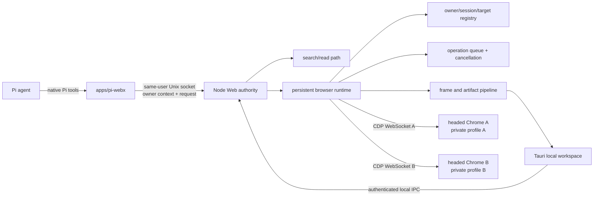
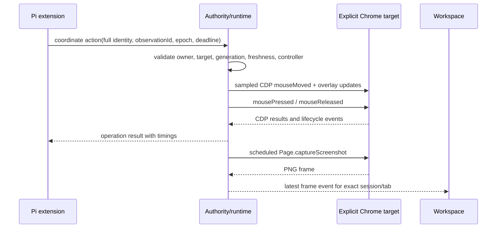

# Screenshot-first browser architecture

## Recommendation

Use TypeScript for the Pi extension, SDK, browser authority, browser runtime, CDP driver, and local workspace protocol. Keep Tauri only as a thin desktop shell around a local React viewer. Do not keep Rust in the browser control path unless packaging evidence later shows a concrete need. A single language makes ownership types, protocol validation, cancellation, target mapping, and tests easier to review.

Keep three long-lived process boundaries:

1. **Pi process with native extension**: agent-facing tools and user commands only.
2. **Web authority plus browser runtime**: a same-user Node service. It owns policy, sessions, operations, CDP connections, frames, and artifacts. It launches Chrome only at session create.
3. **One headed Chrome host per agent browser session**: one isolated profile and one loopback debugging endpoint.

The Tauri workspace is a fourth optional process. It is a viewer and user-control client. It never becomes browser authority. Search, direct reading, document conversion, and their services stay outside the browser host lifecycle.

## Clean-slate component view



## General search and read path

`web_search`, `web_read`, `web_read_batch`, and `web_content` remain the default internet path. The Pi extension asks the authority for these operations without starting Chrome. Browser creation occurs only for dynamic rendering, interaction, or a visual check that the read path cannot supply. Browser failure must not disable healthy search and read capabilities.

## Browser authority boundary

The Node authority is the only component allowed to:

- create or close a browser session;
- allocate a profile and debugging endpoint;
- map an agent owner to a browser host and target;
- accept an operation, change its state, or cancel it;
- issue CDP commands;
- publish a frame or browser artifact;
- grant or revoke user control.

The workspace selection, Chrome focus, OS focus, and CDP’s current target are presentation state. They never grant authority. The authority validates `ownerId`, `agentSessionId`, `browserSessionId`, `tabId`, `targetId`, `controlEpoch`, `operationId`, and `deadline` before dispatch.

Production transport uses a private Unix socket in a `0700` runtime directory. The socket is `0600` or owner-only by directory policy. The daemon derives the peer user where the platform supports it. A random bearer value can protect an HTTP bridge used by Tauri, but it belongs in an authorization header or IPC handshake, never a URL. Raw CDP ports bind to `127.0.0.1` and are not exposed to extension or workspace clients.

## Persistent browser runtime and Chrome hosts

Session creation performs one lifecycle transaction:

1. Reserve IDs and a control epoch.
2. Create a private profile directory.
3. Launch the configured headed Chrome executable with that profile and `--remote-debugging-address=127.0.0.1 --remote-debugging-port=0`.
4. Read `DevToolsActivePort` from that profile.
5. Connect one persistent browser-level CDP WebSocket.
6. create or discover an explicit page target;
7. attach with a flattened CDP target session;
8. install lifecycle listeners and the cursor preload script;
9. publish `session.ready` only after a screenshot succeeds.

Chrome’s sandbox, web security, site isolation, and certificate checks remain at defaults. A launch-policy module owns an allowlist of flags. It rejects unsafe configured flags. The executable and effective command line appear in diagnostics without secrets.

Each simulated agent session gets one dedicated Chrome browser process for the initial release. Multiple tabs can live in that process. A `BrowserHost` owns the child process, profile, endpoint, browser CDP connection, and exit state. A `TabTarget` owns target ID, flattened CDP session ID, top-frame ID, document generation, viewport generation, and cursor overlay state.

## Explicit target registry

```text
OwnerRecord
  ownerId
  agentSessionId
    BrowserSessionRecord
      browserSessionId
      browserHostId -> process/profile/CDP
      controlEpoch
      controller = agent | user | none
        TabRecord
          tabId
          targetId
          cdpSessionId
          topFrameId
          documentGeneration
          viewportGeneration
          latestFrameSequence
```

A lookup uses the full address. It verifies every parent-child relation. A target ID from browser A cannot pass lookup under browser B even if the caller has a valid owner ID. Tab focus is an explicit operation for user presentation or site behavior. It is never implicit target selection.

## Screenshot and frame pipeline

The runtime captures screenshots on a bounded schedule independent of actions. Default production policy should start at 2 frames per second for selected or recently active sessions and reduce to a low idle rate for unselected sessions. Only one screenshot capture can be pending per tab. A slow consumer receives the latest complete frame, not an unbounded queue.

A frame record contains:

- owner, browser session, tab, target, and control epoch;
- observation ID and operation correlation when applicable;
- document and viewport generations;
- monotonically increasing frame sequence;
- URL, title, timestamp, CSS viewport, device-pixel ratio, and scroll offset;
- media type, byte length, and SHA-256;
- an inline bounded image or an owner-scoped artifact ID.

PNG is the correctness default. JPEG or WebP can become a negotiated viewer transport after visual tests. The agent receives screenshot-first observations. The runtime does not run DOM extraction during each capture.

Coordinate actions cite an observation ID. Initial freshness policy is 3 seconds plus exact owner/target/document/viewport generation, CSS viewport, device-pixel ratio, and near-equal scroll offset. It does not require equal screenshot bytes. This permits animation. It can miss an element that moves inside a stable viewport. High-risk actions can require a newer frame or a local region check in a later phase.

## Virtual mouse and CDP driver

The custom `CdpBrowserDriver` implements AgentCursor’s browser-driver concept with explicit target binding. One driver instance exists per tab. One persona and cursor state exist per browser session. The action service creates timed sampled paths from AgentCursor’s path engine. It dispatches `Input.dispatchMouseEvent` to the tab’s flattened CDP session and updates the overlay for each sample.

The preload script installs a fixed, pointer-events-none, maximum-z-index cursor overlay. The runtime restores it after navigation and before capture. Page code can still remove or cover an in-page overlay. The driver verifies presence and reinjects. A dedicated isolated-world overlay is preferred if screenshot composition tests prove that it is captured consistently.

CDP supplies navigation, input, key events, screenshots, layout, accessibility, and lifecycle signals. DOM fallback is a separate operation. It uses the Accessibility and DOM domains and returns bounded document-generation handles.

## Operations, deadlines, and cancellation

An operation moves through `queued -> running -> committed | failed | cancelled | expired`. The runtime serializes mutating actions per tab. Independent tabs and sessions run concurrently. Screenshot capture can run between path samples when capacity permits so the workspace can show movement.

Every request has an absolute deadline. Queue admission rejects an expired request. Cancellation removes queued work immediately. Running CDP commands cannot always be recalled. Cancellation marks the operation, stops future path samples or command steps, and discards any late result. A navigation or click already sent to Chrome can have side effects; the terminal status reports `cancelled_after_dispatch` rather than claiming rollback.

Control takeover increments `controlEpoch`. All queued agent actions from the prior epoch are cancelled. The user controls one explicit session and tab. Returning control increments the epoch again. This prevents an old agent action from becoming valid after an agent-user-agent sequence.

## Workspace

The production Tauri workspace replaces the spike’s HTTP viewer. Its webview renders only local bundled UI. It receives frame bytes and metadata from the authority. It does not navigate to the controlled page.

The workspace:

- lists explicit agent and browser sessions;
- keeps selection separate from authority;
- shows connection, URL, frame age, frame sequence, cursor, and controller;
- switches frames only after matching the selected full identity;
- requests takeover and return through authority operations;
- applies latest-frame backpressure;
- clears a frame immediately when a session closes or ownership changes.

## Artifacts

Large screenshots use the existing controlled artifact concept after it is adapted to browser ownership. Artifact metadata includes owner, browser session, tab, document generation, frame sequence, media type, size, hash, creation time, and expiry. Reads verify owner and hash. Paths are never accepted from a model or remote page. Browser profiles, cookies, storage, and raw CDP traces are not artifacts.

## Recovery

- **Chrome startup failure:** remove the new profile and return a bounded diagnostic.
- **Chrome exit or CDP disconnect:** fail running operations, mark tabs disconnected, stop frame capture, and publish lifecycle events. Never attach another agent’s host.
- **Target close:** remove only that tab and invalidate its observations and handles.
- **Authority restart:** initial release marks old sessions lost and removes verified orphan profiles after checking ownership metadata and process liveness. Later recovery can reconnect only with a persisted random host secret and exact process/endpoint identity.
- **Overlay loss:** reinject before input and screenshot. Report degraded status if verification still fails.
- **Profile corruption:** quarantine or remove the session-owned disposable profile. Never retry with the user profile.

## Deployment on Fedora

Install one Node runtime service and the Tauri workspace. Run the Node authority as a same-user systemd service. Chrome processes inherit the logged-in graphical session when the user requests headed browser support. The doctor checks `DISPLAY` or `WAYLAND_DISPLAY`, Chrome executable/version, runtime-directory mode, socket mode, profile root, CDP loopback binding, and effective launch flags.

Prefer Google Chrome when installed. Support `BROWSER_EXECUTABLE` or equivalent configuration for Fedora Chromium and Chrome for Testing. Chromium can differ in codecs, enterprise policy, bundled services, release cadence, executable wrappers, and user agent. Automated fixtures must not depend on those differences.

Wayland and X11 affect window placement and later OS-level input. They do not change CSS coordinates sent through CDP. Fractional display scaling still affects the visible desktop and workspace, so production tests must cover device-pixel ratio and multi-monitor movement.

## Data flow for one action


