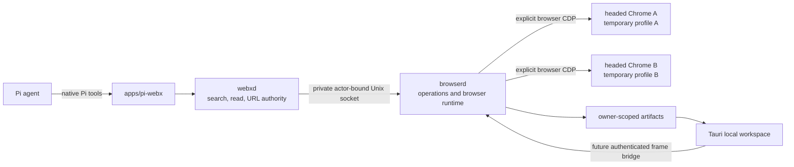

# Screenshot-first browser architecture

## Recommendation

Use TypeScript for the Pi extension, web authority, browser protocol, browser runtime, and CDP driver. Keep browser control in a separate long-lived Node service named `browserd`. Keep Tauri as a local screenshot workspace. Do not put Chrome lifecycle or CDP state inside `webxd`.

The intended process boundary is:



Phase 1 adds `packages/browser-protocol`, `packages/browser-runtime`, and `apps/browserd` in parallel with the current production stack. It does not connect `webxd`, the Pi tools, or the current workspace to the new runtime.

## Process responsibilities

### Pi native extension

The extension supplies model-facing tools. It uses `webxd` as the policy boundary. It will not connect directly to CDP or select an active tab.

### webxd

`webxd` remains healthy when Chrome or `browserd` fails. It owns public navigation policy and attestation. It also owns search, direct read, cache, content, and destination policy. In a later phase, it will authenticate to `browserd` and bind each connection to one principal and Pi agent session.

### browserd

`browserd` is a separate persistent Node process. It owns:

- the private Unix socket and per-start descriptor;
- connection-bound actor identity;
- browser session, tab, and target registries;
- one Chrome host and temporary profile per browser session;
- one browser-level CDP connection per Chrome host;
- operation lanes, deadlines, cancellation, and control epochs;
- virtual-mouse motors;
- screenshot observations, workspace frames, DOM handles, and artifacts;
- failure settlement and deterministic cleanup.

A browser or CDP failure cannot crash healthy `webxd` search and read work.

### Chrome host

Each browser session gets one headed Chrome or Chromium process. Each process gets a new private `0700` profile. `DevToolsActivePort` supplies a race-free loopback endpoint. The runtime keeps one browser-level CDP WebSocket and attaches each page through an explicit flattened CDP session.

The runtime does not accept a profile path or arbitrary Chrome flags from a request. It rejects flags that disable the sandbox, web security, certificate checking, or site isolation.

### Tauri workspace

The future Tauri workspace renders local UI and screenshot bytes only. It must not embed arbitrary remote sites. Workspace selection is presentation state. It does not grant browser authority or create an implicit active tab.

## Actor and authority model

A new socket connection first supplies the per-start binding secret and one actor identity:

```text
ActorIdentity
  principalId
  agentSessionId
```

The connection binds once. It cannot bind again. Ordinary requests contain no principal or agent-session fields. They cannot replace the actor identity. Browser session lookup compares the bound actor to the session owner. Ownership failures use a not-found result and do not reveal whether another actor's object exists.

The Phase 1 binding secret authenticates access to the owner-only descriptor. `webxd` is the intended trusted caller. The same-user boundary does not defend against a process that already runs as the same Unix user and can read that descriptor. A future multi-principal deployment must add an actor-specific attestation rather than treating the shared descriptor secret as actor proof.

All tab work uses this full address:

```text
browserSessionId
  tabId
  targetId
  controlEpoch
```

The registry verifies the full parent-child relation. Chrome focus, workspace selection, OS focus, and the last used tab never supply authority.

## Session, tab, and motor model

One browser session owns:

- one Chrome process;
- one disposable profile;
- one browser CDP connection;
- one persistent AgentCursor persona;
- one persistent cursor position and button state;
- one serialized pointer and keyboard lane.

A browser session can own many explicit tabs. Each tab owns its target ID, flattened CDP session, top-frame ID, document generation, viewport generation, observation records, DOM handles, overlay state, and latest frame.

Pointer actions on two tabs in one browser session serialize through the same motor. Actions in different browser sessions can run concurrently. When the motor moves to another tab, the runtime first restores the session cursor overlay at its current position.

## Target lifecycle

The registry creates and adopts only targets that belong to its exact browser session. It closes or hides the browser bootstrap page. A popup is registered only when its opener is an owned tab. Unknown targets are not adopted.

A target close or crash invalidates its observations, DOM handles, and frame schedule. It also settles affected operations. Renderer replacement, prerender activation, or an unproven target swap fails closed. There is no active-tab or last-tab fallback.

## Two screenshot products

### Agent screenshot observation

An agent observation exists only after an explicit `observe.screenshot` request. It uses lossless PNG in Phase 1. Its bounded metadata includes the exact actor-owned address, URL, title, wall and monotonic capture time, viewport, DPR, scroll, document and viewport generations, frame sequence, digest, cursor state, and validity time.

The image is stored as an owner-scoped artifact unless it is below the reviewed inline limit. Observation metadata stores an artifact ID and digest. It does not retain another full image buffer.

### Workspace live frame

A workspace frame is a separate, short-lived product. A bounded scheduler keeps at most one capture in flight per tab and one latest frame per tab. An idle subscription uses a low rate. A selected subscription uses a higher rate. An active pointer action temporarily uses a burst rate. Slow clients drop replaceable frames.

A workspace frame does not create an agent observation. Frame bytes use owner-scoped artifacts in Phase 1. A later Tauri bridge can use a more direct bounded byte channel after review.

## Screenshot-bound input

A coordinate action cites an observation ID. Admission checks the exact actor-owned address, document generation, viewport generation, freshness, CSS viewport, DPR, scroll tolerance, coordinate bounds, control epoch, deadline, and cancellation state.

Movement alone is not commitment. Immediately before a press, drag press, or wheel dispatch, the runtime repeats the checks. If the page changes after movement, the operation settles as partially dispatched and does not send the irreversible event. The normal policy does not require equal screenshot bytes because animation can change the image. Higher-risk policy can require a newer observation or local region evidence.

## Virtual mouse

The runtime selectively ports AgentCursor `0.3.0` path and persona code from commit `b23c633c66fd240f836f5edd1034f6fcf678e237`. It does not use AgentCursor MCP, extension, stock transport, macOS driver, or full package.

The motor sends sampled CDP input to the exact flattened target session. It supports move, hover, click, double-click, drag, vertical and horizontal wheel, text, and keys. Cancellation stops unsent samples. Cleanup releases recorded buttons and keys when CDP remains available.

A closed-shadow-root overlay has `pointer-events: none`. The runtime installs it for every top-level document and verifies it before input and capture. Mutation tests confirm reinjection while a modal dialog exists. An in-page overlay can still be occluded by browser fullscreen UI, PDF or internal viewers, and top-layer content; the test proves survival, not visual precedence over every top layer. CDP input and the overlay are a virtual page mouse. They are not Linux OS input and do not imply bot-detection immunity.

## DOM fallback

DOM or accessibility inspection is explicit. It does not run for every screenshot. The runtime returns a bounded list of role, name, value, state, bounds, and diagnostic locator text. The public handle is opaque and maps to an internal backend node for one actor, session, tab, target, and document generation.

Navigation invalidates all handles. A detached node returns `HANDLE_STALE`. The runtime does not search a replacement document. Pointer-based fallback actions still use the session motor and its human-style path.

## Operations and control epoch

Operation status is actor-scoped by operation ID. The record does not depend on a live tab address. Status and cancellation remain queryable after tab close, target crash, Chrome exit, or CDP disconnect.

States are `queued`, `running`, `committed`, `failed`, `cancelled`, and `expired`. Dispatch state is separate: `not-dispatched`, `partially-dispatched`, or `dispatched`. Cancellation after a click or navigation dispatch does not claim rollback.

Each absolute deadline is converted to a monotonic budget at admission. Expired queue entries do not dispatch. Duplicate mutation operation IDs do not run twice. Actor-scoped status, cancellation, count, and retention are bounded.

A control takeover increments the session epoch. It cancels queued old-epoch work and stops running work at the next cancellable boundary. A later epoch cannot make an old action valid again. Phase 1 tests this mechanism but does not expose user takeover.

## Transport and artifacts

`browserd` listens only on a Unix-domain socket in a `0700` runtime directory. The descriptor and socket use mode `0600`. The descriptor contains a random per-start secret. The protocol uses bounded newline-delimited JSON. Request and response frames have size limits. A disconnect cancels its pending requests. Events share the same authenticated connection and use droppable backpressure.

Artifacts have random IDs, private storage, owner-scoped reads, SHA-256 integrity, item and total byte limits, entry limits, expiry, and pruning. Callers cannot choose a storage path. Profile paths, CDP URLs, cookies, headers, storage, and page secrets do not appear in ordinary errors.

## Recovery and cleanup

Session creation is transactional. Failure closes CDP, stops Chrome, and removes the owned profile. Normal shutdown sends `Browser.close`, then uses TERM and KILL only if needed. The runtime waits for process settlement before profile deletion.

Profile deletion requires a runtime-owned manifest under the configured root. Startup orphan cleanup checks the exact recorded process identity and removes only a verified dead runtime-owned profile. Symlinks and paths outside the root are rejected.

Chrome exit or CDP disconnect stops frames and settles all session operations. A target failure affects only that target. The runtime never falls back to another browser.

## Navigation policy

Public navigation authority remains in `webxd`. `browserd` has a narrow `NavigationAuthorization` interface. Production defaults to deny when no authorizer is configured. Phase 1 live tests use an authorizer that permits only their deterministic loopback fixture.

## Fedora deployment and resources

The executable comes only from reviewed service configuration. Prefer Google Chrome when it is already installed. Support configured Fedora Chromium. Do not install a browser as a runtime side effect.

Linux resource evidence uses `/proc/<pid>/smaps_rollup` PSS as the primary memory metric. Summed RSS can double-count shared pages and is not the production decision metric. Keep one Chrome process per browser session until PSS evidence and a separate architecture decision justify a change.
